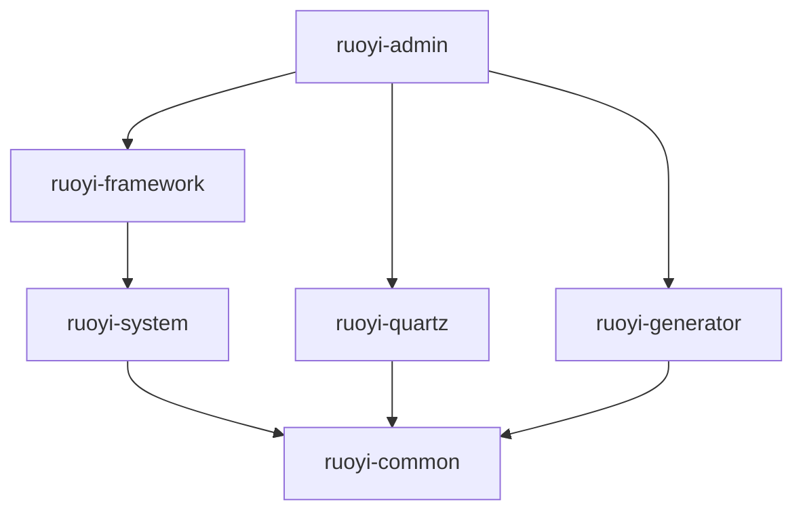
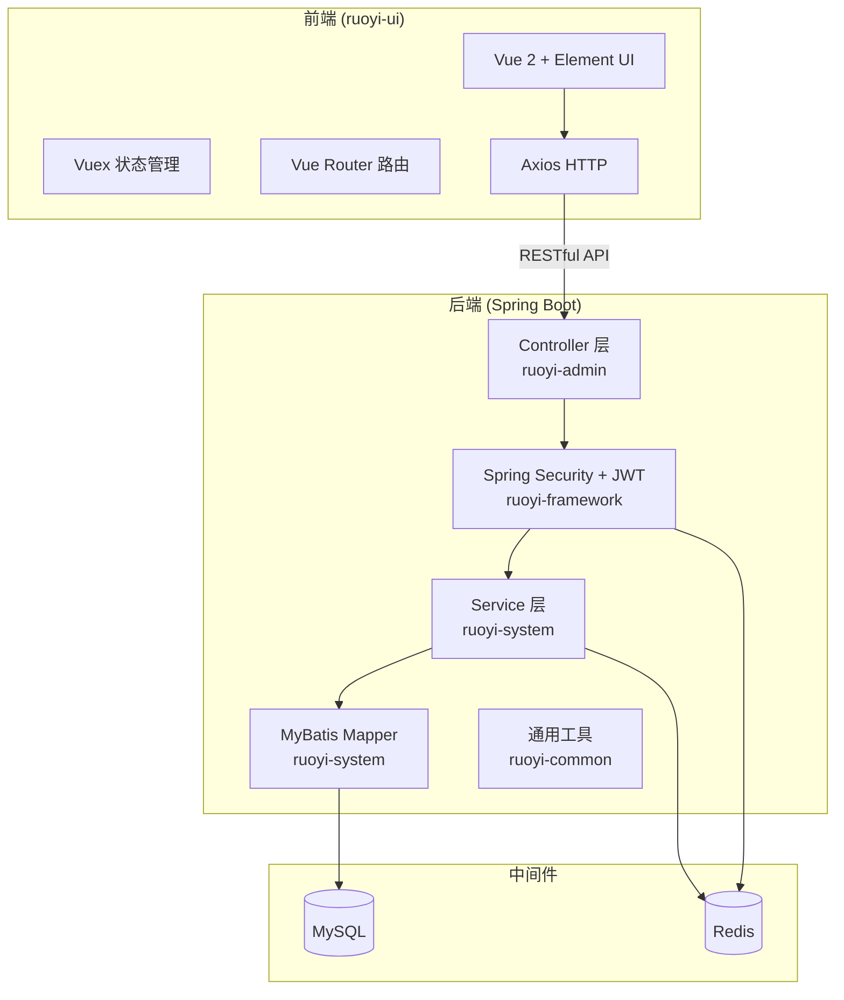
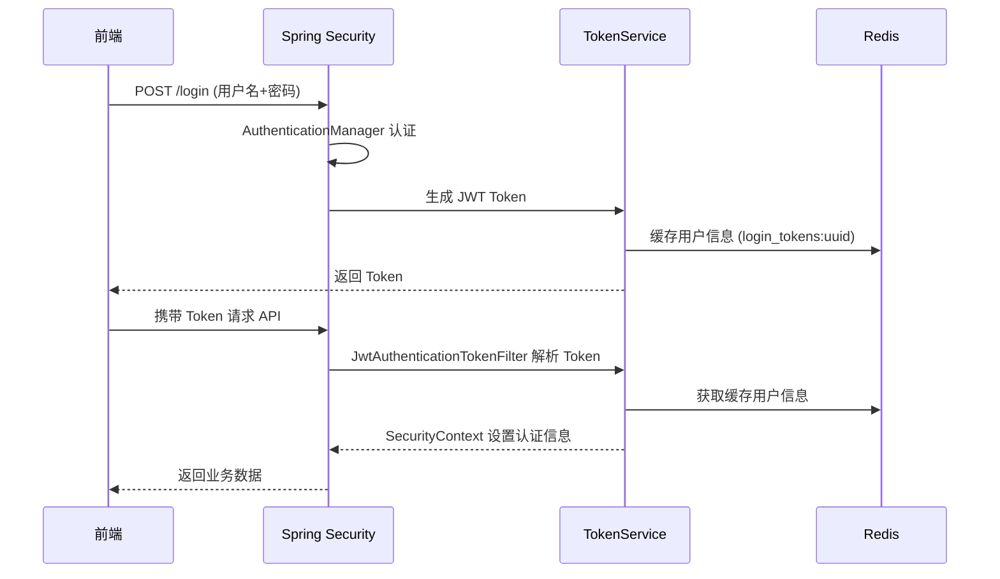

# RuoYi-Vue 技术架构文档

> **项目版本**: 3.9.1 | **架构模式**: 前后端分离 | **构建工具**: Maven (后端) + Vue CLI (前端)

---

## 一、项目概述

RuoYi-Vue 是一套基于 **Spring Boot + Vue** 的前后端分离企业级后台管理系统，提供了用户管理、角色管理、部门管理、菜单管理、定时任务、代码生成等常用功能模块。

---

## 二、技术栈总览

### 后端技术栈

| 技术 | 版本 | 说明 |
|------|------|------|
| Java | 1.8 | 编程语言 |
| Spring Boot | 2.5.15 | 核心框架 |
| Spring Framework | 5.3.39 | 基础框架 |
| Spring Security | 5.7.14 | 安全认证与授权 |
| MyBatis | — | ORM 持久层框架 |
| PageHelper | 1.4.7 | 分页插件 |
| Druid | 1.2.27 | 数据库连接池 |
| Redis (Lettuce) | — | 缓存中间件 |
| JWT (jjwt) | 0.9.1 | Token 认证 |
| Swagger 3 (Springfox) | 3.0.0 | API 文档 |
| Fastjson2 | 2.0.60 | JSON 解析 |
| Apache POI | 4.1.2 | Excel 导入/导出 |
| Quartz | — | 定时任务调度 |
| Velocity | 2.3 | 代码生成模板引擎 |
| Kaptcha | 2.3.3 | 验证码生成 |
| Yauaa | 7.32.0 | UA 解析 (浏览器/OS) |
| Oshi | 6.9.1 | 系统信息监控 |
| Tomcat (内嵌) | 9.0.112 | Web 容器 |
| Logback | 1.2.13 | 日志框架 |
| MySQL | — | 关系型数据库 |

### 前端技术栈

| 技术 | 版本 | 说明 |
|------|------|------|
| Vue.js | 2.6.12 | 前端框架 |
| Vue Router | 3.4.9 | 路由管理 |
| Vuex | 3.6.0 | 状态管理 |
| Element UI | 2.15.14 | UI 组件库 |
| Axios | 0.28.1 | HTTP 请求库 |
| ECharts | 5.4.0 | 数据可视化图表 |
| Quill | 2.0.2 | 富文本编辑器 |
| Vue CLI | 4.4.6 | 脚手架工具 |
| Sass | 1.32.13 | CSS 预处理器 |
| JS-Cookie | 3.0.1 | Cookie 操作 |
| JSEncrypt | 3.0.0-rc.1 | RSA 加密 |
| Screenfull | 5.0.2 | 全屏控制 |

---

## 三、模块结构

### 3.1 整体模块划分

```
ruoyi (父工程 pom)
├── ruoyi-admin        # Web 服务入口 (启动模块)
├── ruoyi-framework    # 框架核心 (配置/安全/拦截)
├── ruoyi-system       # 系统业务模块 (用户/角色/菜单等)
├── ruoyi-common       # 通用工具模块 (工具类/注解/常量)
├── ruoyi-quartz       # 定时任务模块
├── ruoyi-generator    # 代码生成模块
└── ruoyi-ui           # 前端 Vue 项目
```

### 3.2 模块依赖关系



> **依赖链**: `admin` → `framework` → `system` → `common` (主链) ，`admin` → `quartz`/`generator` → `common` (功能分支)

---

## 四、各模块详解

### 4.1 ruoyi-admin (启动模块)

**职责**: Web 服务入口，应用启动类、Controller 汇总、配置文件存放

| 包/目录 | 说明 |
|---------|------|
| `com.ruoyi.RuoYiApplication` | Spring Boot 启动类 |
| `com.ruoyi.web.controller.common` | 通用接口 (验证码/文件上传) |
| `com.ruoyi.web.controller.monitor` | 监控管理接口 |
| `com.ruoyi.web.controller.system` | 系统管理接口 |
| `com.ruoyi.web.controller.tool` | 工具类接口 (Swagger/代码生成) |
| `resources/application.yml` | 主配置文件 |
| `resources/application-druid.yml` | Druid 数据源配置 |

### 4.2 ruoyi-framework (框架核心)

**职责**: 框架级基础设施 — 安全认证、数据源、AOP、拦截器、全局配置

| 包 | 说明 |
|---|------|
| `config` | 核心配置类：Security、Druid、MyBatis、Redis、线程池、验证码、Filter、I18n |
| `security` | Spring Security 安全体系：认证过滤器、上下文管理、登录/登出处理器 |
| `aspectj` | AOP 切面：日志记录、数据权限、限流等 |
| `datasource` | 动态数据源 (主从切换) |
| `interceptor` | 拦截器：防重复提交 |
| `manager` | 异步管理器 + ShutdownManager |
| `web` | Web 层异常处理 |

**关键配置类**:

| 类名 | 说明 |
|------|------|
| `SecurityConfig` | Spring Security 安全配置 |
| `DruidConfig` | 数据源配置 (支持主从) |
| `MyBatisConfig` | MyBatis 配置 |
| `RedisConfig` | Redis 序列化与模板配置 |
| `ThreadPoolConfig` | 线程池配置 |
| `ResourcesConfig` | 静态资源/CORS 配置 |
| `FilterConfig` | XSS/防盗链过滤器配置 |

### 4.3 ruoyi-system (系统业务)

**职责**: 核心业务实体、Mapper 接口、Service 层

| 包 | 说明 |
|---|------|
| `domain` | 实体类：SysUser、SysRole、SysDept、SysMenu、SysConfig 等 |
| `mapper` | MyBatis Mapper 接口 |
| `service` | 业务逻辑层 (接口 + 实现) |

### 4.4 ruoyi-common (通用工具)

**职责**: 整个项目共用的工具类、注解、常量、异常定义

| 包 | 说明 |
|---|------|
| `annotation` | 自定义注解 (@Log, @DataScope, @RateLimiter 等) |
| `config` | 通用配置 |
| `constant` | 常量定义 |
| `core/controller` | BaseController 基类 |
| `core/domain` | 基础实体 (BaseEntity, AjaxResult, TreeEntity 等) |
| `core/page` | 分页支持 (PageDomain, TableSupport) |
| `core/redis` | RedisCache 缓存操作封装 |
| `core/text` | 文本处理工具 |
| `enums` | 枚举类 |
| `exception` | 自定义异常体系 |
| `filter` | 通用过滤器 |
| `utils` | 工具类 (StringUtils, DateUtils, SecurityUtils 等) |
| `xss` | XSS 防护过滤 |

### 4.5 ruoyi-quartz (定时任务)

**职责**: 基于 Quartz 的定时任务管理

- 依赖 `quartz` 库 + `ruoyi-common`
- 提供任务的增删改查、暂停/恢复、立即执行、日志记录

### 4.6 ruoyi-generator (代码生成)

**职责**: 基于 Velocity 模板的 CRUD 代码生成器

- 依赖 `velocity-engine-core` + `ruoyi-common` + `druid`
- 读取数据库表结构，自动生成前后端代码

### 4.7 ruoyi-ui (前端)

**职责**: Vue 2 单页面应用，与后端通过 RESTful API 通信

```
src/
├── api/          # 后端 API 接口封装 (Axios)
├── assets/       # 静态资源 (图片/样式)
├── components/   # 公共组件
├── directive/    # 自定义指令 (权限控制等)
├── layout/       # 页面布局 (侧边栏/导航栏/主体)
├── plugins/      # 插件注册
├── router/       # 路由配置
├── store/        # Vuex 状态管理
├── utils/        # 工具函数
├── views/        # 页面视图
├── App.vue       # 根组件
├── main.js       # 入口文件
├── permission.js # 路由权限控制 (前置守卫)
└── settings.js   # 全局设置
```

---

## 五、系统架构图



---

## 六、核心机制

### 6.1 安全认证流程



### 6.2 数据源配置

- **连接池**: Alibaba Druid
- **主从支持**: 支持配置 master/slave 数据源，通过 `@DataSource` 注解切换
- **监控**: 内置 Druid 监控面板 (`/druid/*`)

### 6.3 数据权限

通过 `@DataScope` 注解实现数据权限过滤，支持按部门和用户级别的数据隔离。

### 6.4 缓存策略

- **Redis** 作为核心缓存：登录令牌、字典数据、参数配置、限流计数
- **Lettuce** 作为 Redis 客户端 (连接池配置)

---

## 七、运行环境

| 项 | 要求 |
|----|------|
| JDK | 1.8+ |
| MySQL | 5.7+ |
| Redis | 3.0+ |
| Maven | 3.0+ |
| Node.js | 8.9+ |
| npm | 3.0+ |

### 启动方式

```bash
# 后端
mvn clean package
java -jar ruoyi-admin/target/ruoyi-admin.jar

# 前端
cd ruoyi-ui
npm install
npm run dev
```

### 核心端口

| 服务 | 端口 |
|------|------|
| 后端 API | 8080 |
| 前端开发服务器 | 80 (代理至 8080) |
| Redis | 6379 |
| MySQL | 3306 |

---

## 八、数据库

- **主库**: `ry-vue` (MySQL)
- **初始化脚本**: [ry_20250522.sql](file:///e:/MyDocNew/RuoYiNew/sql/ry_20250522.sql)
- **Quartz 表**: [quartz.sql](file:///e:/MyDocNew/RuoYiNew/sql/quartz.sql)

---

## 九、项目目录树

```
RuoYiNew/
├── pom.xml                          # 父工程 POM
├── sql/                             # 数据库脚本
│   ├── ry_20250522.sql
│   └── quartz.sql
├── ruoyi-admin/                     # 启动模块
│   └── src/main/
│       ├── java/com/ruoyi/
│       │   ├── RuoYiApplication.java
│       │   └── web/controller/      # Controller (common/monitor/system/tool)
│       └── resources/
│           ├── application.yml
│           └── application-druid.yml
├── ruoyi-framework/                 # 框架核心
│   └── src/main/java/com/ruoyi/framework/
│       ├── config/                  # 配置类 (Security/Druid/MyBatis/Redis...)
│       ├── security/                # 安全过滤器 & 处理器
│       ├── aspectj/                 # AOP 切面
│       ├── datasource/              # 动态数据源
│       ├── interceptor/             # 拦截器
│       ├── manager/                 # 异步管理
│       └── web/                     # 异常处理
├── ruoyi-system/                    # 系统业务
│   └── src/main/java/com/ruoyi/system/
│       ├── domain/                  # 实体类
│       ├── mapper/                  # Mapper
│       └── service/                 # Service
├── ruoyi-common/                    # 通用工具
│   └── src/main/java/com/ruoyi/common/
│       ├── annotation/              # 自定义注解
│       ├── constant/                # 常量
│       ├── core/                    # 基类 & Redis 封装
│       ├── enums/                   # 枚举
│       ├── exception/               # 异常
│       ├── filter/                  # 过滤器
│       ├── utils/                   # 工具类
│       └── xss/                     # XSS 防护
├── ruoyi-quartz/                    # 定时任务
├── ruoyi-generator/                 # 代码生成
└── ruoyi-ui/                        # 前端 Vue 项目
    ├── package.json
    └── src/
        ├── api/                     # API 接口
        ├── components/              # 公共组件
        ├── layout/                  # 页面布局
        ├── router/                  # 路由
        ├── store/                   # Vuex
        ├── views/                   # 页面视图
        └── utils/                   # 工具函数
```
